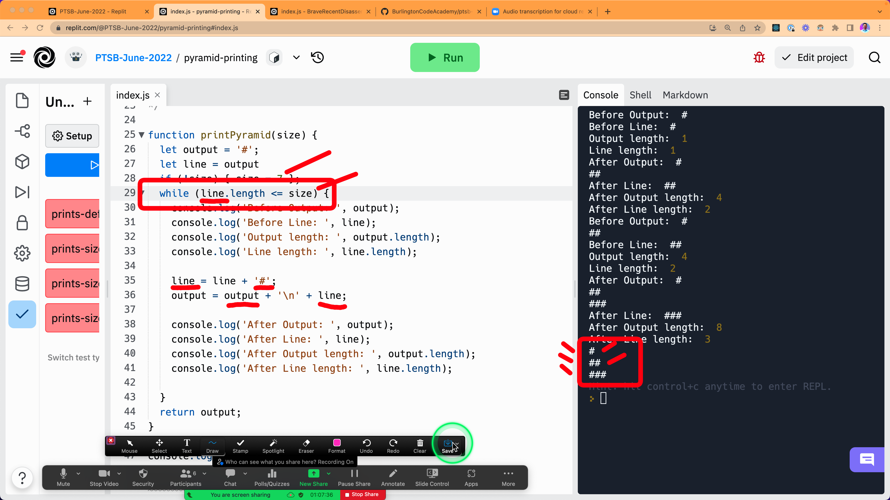
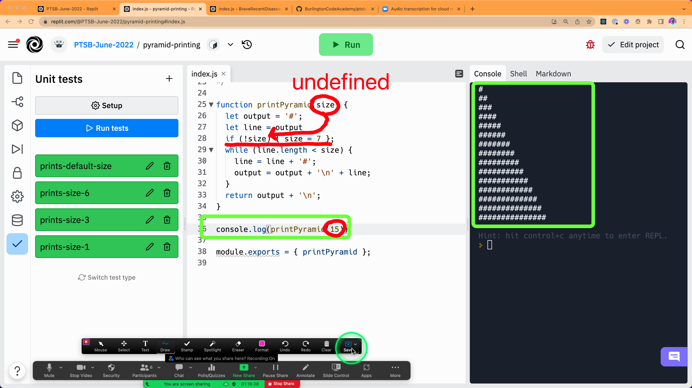
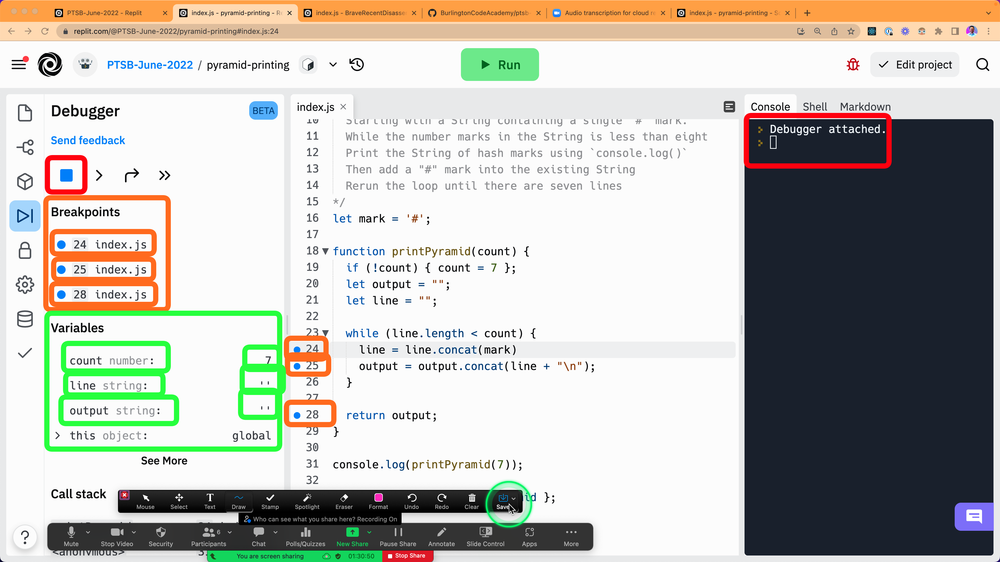
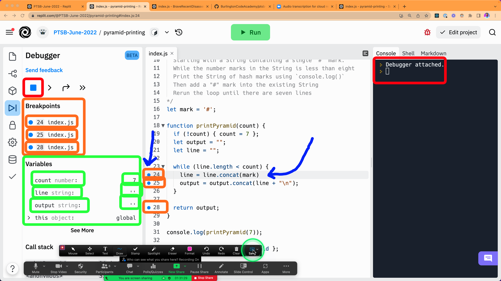
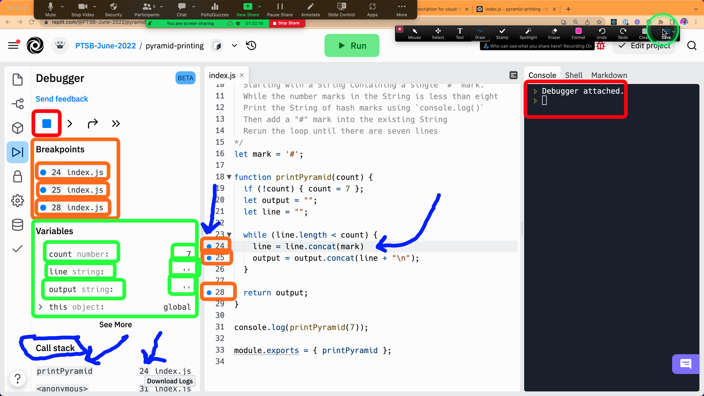
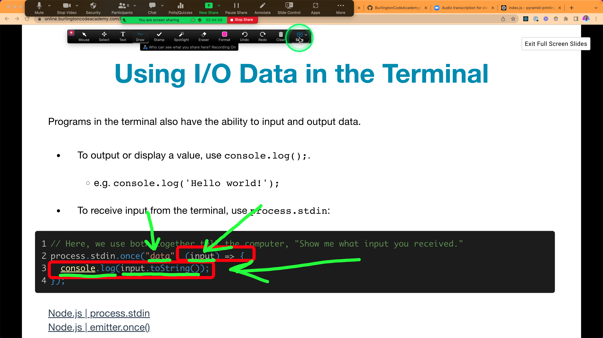
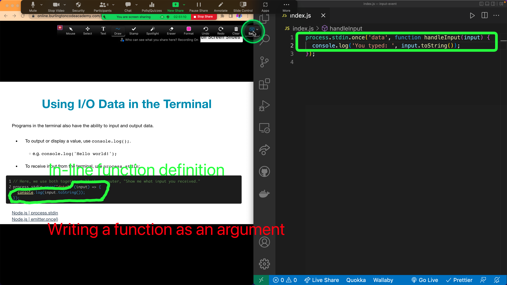
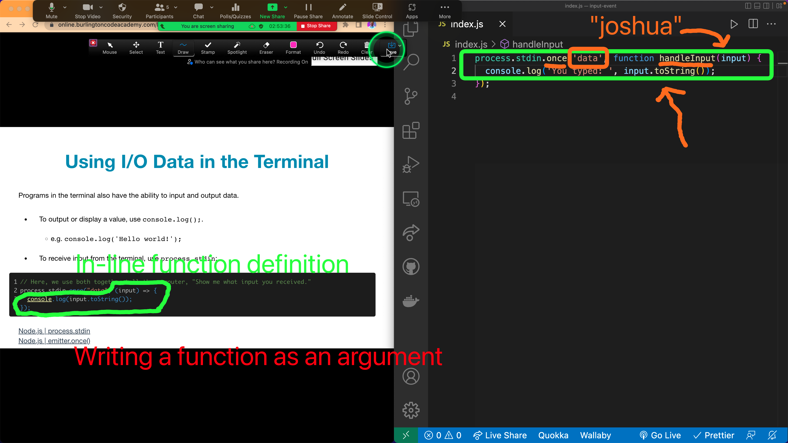
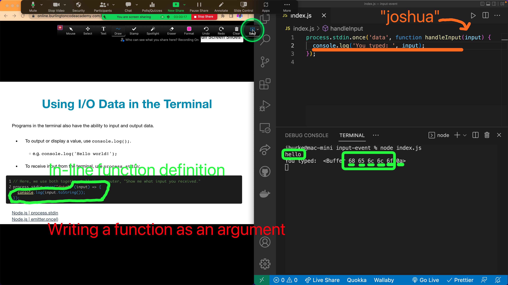
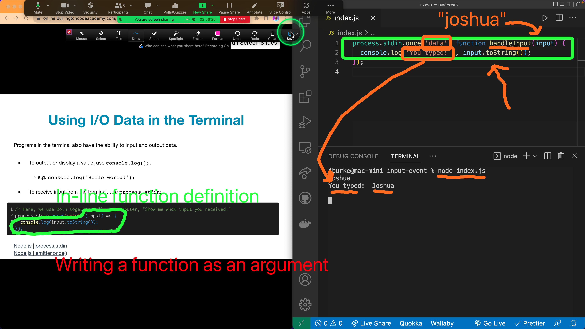

# Thursday, 2022-07-07

## Table-of-Contents

- [Thursday, 2022-07-07](#thursday-2022-07-07)
  - [Table-of-Contents](#table-of-contents)
  - [Agenda](#agenda)
  - [Homework and Labs](#homework-and-labs)
    - [What Color is Your Function](#what-color-is-your-function)
    - [One-Potato](#one-potato)
    - [Chessboard-Marks](#chessboard-marks)
    - [Fizz-Buzz](#fizz-buzz)
    - [Minimum](#minimum)
  - [Lab Reviews](#lab-reviews)
    - [Pyramid Printing Lab](#pyramid-printing-lab)
  - [Screenshots](#screenshots)

## Agenda

- Review Homework Assignments
  - [Pyramid-Printing-Lab](#pyramid-printing-lab)
- Input-and-Output-Part-1-Lecture
  - [Input-and-Output-Part-1-Recording](https://us02web.zoom.us/rec/share/EQloPz3acc5G1Kl9ypFVITxp4a29VPBaxjDPiVMg1POfHuAS5fo1UN_bacg1OqI.2gOKJ4lVDG1MfkdY?startTime=1657239309000)

## Homework and Labs

> These labs were from the prior class assignment, as many students had yet to finish them and submit the work.

### What Color is Your Function

- Due: 2022-07-10
- <https://journal.stuffwithstuff.com/2015/02/01/what-color-is-your-function/>

### One-Potato

- Due: 2022-07-07
- <https://replit.com/team/PTSB-June-2022/one-potato>

### Chessboard-Marks

- Due: 2022-07-07
- <https://replit.com/team/PTSB-June-2022/chessboard-marks>

### Fizz-Buzz

- Due: 2022-07-07
- <https://replit.com/team/PTSB-June-2022/fizz-buzz>

### Minimum

- Due: 2022-07-07
- <https://replit.com/team/PTSB-June-2022/minimum>

## Lab Reviews

### Pyramid Printing Lab

- [Pyramid-Printing-Lab-Review-Recording](https://us02web.zoom.us/rec/share/EQloPz3acc5G1Kl9ypFVITxp4a29VPBaxjDPiVMg1POfHuAS5fo1UN_bacg1OqI.2gOKJ4lVDG1MfkdY?startTime=1657232160000)

## Screenshots

- 
- 
- 
- 
- 
- 
- 
- 
- 
- 
